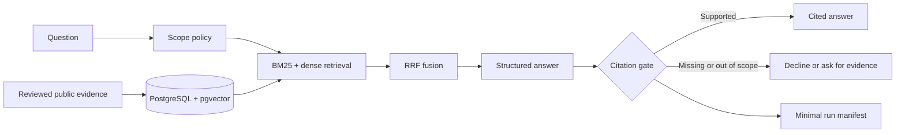

<div align="center">

# 🧭 Career Evidence Agent

**Evidence-grounded career Q&A · cited answers · controlled private workflows**

[](apps/api/pyproject.toml)
[](apps/api/)
[](infra/)
[](apps/api/src/career_agent/workflows/)
[](https://github.com/catRiceY/career-evidence-agent/actions/workflows/api-tests.yml)

</div>

A career assistant that answers questions about my research and projects **from reviewed evidence, with source citations**. The public Q&A path is designed for a portfolio; separate, controlled workflows support job-description matching and interview practice without publishing private career records.

## How public Q&A works



The system does not treat an arbitrary document as a fact. Evidence, claims, and sources have explicit review states; retrieval and answer generation use only the claims allowed for the current scope.

## What is implemented

| Area | Engineering work |
| --- | --- |
| Evidence registry | Typed Evidence / Claim / Source records, review decisions, canonical import, and public-only seeding. |
| Hybrid retrieval | BM25-style sparse search plus pgvector embeddings, combined with reciprocal-rank fusion (RRF). |
| Answer harness | Structured statements, allowed-source checks, citation validation, and refusal when support is missing. |
| Private workflows | Bounded LangGraph flows for JD matching, interview questions, and evidence-aware feedback; tests use synthetic inputs. |
| Evaluation | Retrieval baselines, public-answer safety cases, policy tests, and inspectable run manifests. |

No benchmark score or production availability is claimed here: this repository is an engineering snapshot, not a hosted multi-user service.

## Repository layout

```text
apps/api/                   FastAPI routes, retrieval, answer harness, workflows, tests
evidence/registry/approved/ Reviewed public evidence cards
evidence/reviews/           Public-safe review decisions
evals/                      Retrieval and answer-safety cases
infra/                      Local PostgreSQL + pgvector configuration
docs/                       Public deployment boundary
```

Real private evidence, source documents, job descriptions, interview answers, and private evaluation outputs are **not included** in this public repository. Private HTTP routes are disabled unless local owner configuration is explicitly supplied; that local token is not a production authentication system.

## Run the tests

Requires Python 3.11+ and [uv](https://docs.astral.sh/uv/):

```bash
cd apps/api
uv sync --extra dev
uv run --extra dev pytest
```

For local database setup, evidence import, and API endpoints, see the [API guide](apps/api/README.md). The [deployment boundary](docs/public-deployment.md) documents exactly what can and cannot be included in a public service.

## Current scope

The public API, hybrid retrieval, citation gate, policy checks, and workflow contracts are implemented. Production sign-in, persistent private web sessions, and a hosted public frontend are outside this release. A public deployment must seed only `evidence/registry/approved/` and protect paid answer requests with appropriate rate limits.
