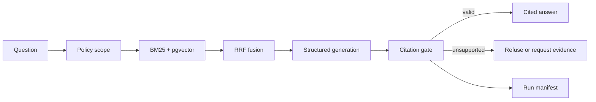

# Career Evidence Agent

An evidence-grounded career assistant that turns reviewed project and research
records into cited answers. The public API is designed for recruiter-facing
questions; the same backend also contains controlled workflows for JD matching
and interview preparation without shipping any real private evidence in this
repository.

## What this demonstrates

- **Evidence-first RAG** — facts are modelled as reviewed Evidence, Claim and
  Source records rather than treating arbitrary documents as truth.
- **Hybrid retrieval** — BM25-style sparse retrieval and pgvector dense search
  are combined with reciprocal-rank fusion.
- **Citation validation** — every factual answer statement must cite an allowed,
  retrieved claim before it can be returned.
- **Public/private boundaries** — the same policy is applied during retrieval,
  tool access, citation checking and output validation.
- **LangGraph workflows** — structured JD matching, mock-interview planning and
  evidence-aware answer feedback are implemented as bounded workflows.
- **Evaluation harness** — retrieval baselines, safety cases, policy tests and
  run manifests make failures inspectable and repeatable.



## Repository layout

```text
apps/api/                  FastAPI application, retrieval, Harness and workflows
evidence/registry/approved Public, reviewed canonical evidence
evidence/reviews/          Public-safe human review decisions
evals/                     Public retrieval and answer-safety cases
infra/                     Local PostgreSQL + pgvector configuration
docs/                      Public deployment boundary
```

Real private evidence, source documents, JD inputs, interview answers and
private evaluation outputs are intentionally excluded. Tests for private
workflow behaviour use synthetic fixtures only.

## Run the test suite

Python 3.11 or newer and [`uv`](https://docs.astral.sh/uv/) are recommended.

```bash
cd apps/api
uv sync --extra dev
uv run --extra dev pytest
```

## Run the public API locally

Start PostgreSQL with pgvector, apply migrations and seed only the public
registry:

```bash
cp infra/.env.example infra/.env
docker compose --env-file infra/.env -f infra/compose.yaml up -d db

cd apps/api
uv run alembic upgrade head
uv run python -m career_agent.evidence.import_canonical \
  --database-url "$CAREER_AGENT_DATABASE_URL" \
  --cards-dir ../../evidence/registry/approved
uv run uvicorn career_agent.api.main:create_app --factory --reload
```

The main public endpoints are documented in [apps/api/README.md](apps/api/README.md).
Cloud deployment boundaries are documented in
[docs/public-deployment.md](docs/public-deployment.md).

## Status

This repository is a portfolio-ready engineering snapshot, not a hosted
multi-user service. The public Q&A path, retrieval, citation gate, policies and
workflow contracts are implemented; production authentication and a persistent
private web session are outside this public release.

